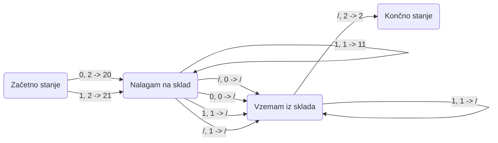

# Skladovni avtomati

Projekt vsebuje implementacijo skladovnih avtomatov, kar so končni avtomati z dodanim skladom. Sklad je mogoče obravnavati kot set krožnikov v omari, kjer krožnik lahko dodaš na set ali pa ga iz njega vzameš, nikoli pa ne moreš dostopati do kateregakoli drugega krožnika, razen vrhnjega. So bolj zmogljivi kot končni avtomati, saj so končni avtomati neke vrste podmnožica skladovnih, kajti vsak končni avtomat je le skladovni avtomat, ki pa svojega sklada nikdar ne uporabi (več pa v razdelku "Kako se skladovni avtomati razlikujejo od končnih?"). So pa vseeno manj zmogljivi kot Turingovi stroji, saj ne omogočajo premikanja po vhodnem nizu in spreminjanja le-njega. 

Skladovni avtomat deluje tako, da prebere dani vhodni niz od leve proti desni. V vsakem koraku izbere prehod oziraje se na vhodni simbol, trenutno stanje in simbol na vrhu sklada. Skladovni avtomat lahko tudi upravlja s skladom kot del izvajanja prehoda, kar pomeni, da avtomat lahko potisne določen simbol na vrh sklada, ga od tam vzame ali ne naredi nič od naštetega in sklad pusti takšen, kot je. Če je v vsaki situaciji možen največ en takšen prehod, potem avtomat sodi med deterministične skladovne avtomate, če pa je možnih več prehodov, pa avtomat spada med nedeterministične skladovne avtomate. Pri takih avtomatih rečemo, da je niz sprejet, če obstaja vsaj ena pot, po kateri niz konča v sprejemnem stanju. Na prav take avtomate se bom v svojem projektu osredotočila jaz.

### Kako se skladovni avtomati razlikujejo od končnih?

Končni avtomat začne v enem izmed možnih stanj, nato pa glede na trenutno stanje in trenutni simbol preide v neko novo stanje. Če ob pregledu celotnega niza konča v enem od sprejemnih stanj, je niz sprejet, sicer pa ni. Torej končni avtomat samo gleda na vhodni signal in trenutno stanje: nima sklada, s katerim bi delal, in zato ne more dostopati do prejšnjih vrednosti vhoda. Izbere lahko le novo stanje, ki je posledica sledenja prehodu. Nedeterministični skladovni avtomat pa se razlikuje od končnega avtomata na tri načine:

  1. Uporabi lahko vrh sklada, pri odločanju, kateri prehod naj izvede.
  2. Lahko manipulira s skladom kot del izvajanja prehoda.
  3. Možnih je več prehodov v več različnih stanj hkrati.

### Primer

Delala bom na primeru iskanja palindromov s skladovnim avtomatom. Palindróm je beseda, fraza, število ali katerokoli drugo zaporedje enot, ki imajo to lastnost, da se berejo z obeh strani enako. Osredotočila se bom na palindrome sestavljene iz ničel in enic. Moj avtomat torej sprejema nize, sestavljene iz znakov $0$ in $1$, ki se berejo enako tako z leve kot desne strani. Tak avtomat predstavimo z naslednjim diagramom:

DIAGRAM AVTOMATA:

## Matematična definicija

Ena izmed možnih implementacij skladovnega avtomata, ga opiše takole:
Skladovni avtomat je definiran kot nabor sedmih elementov $M = (Q, \Sigma, \Gamma, \delta, q_0, Z, F)$, kjer so:

- $Q$ - končna množica stanj
- $\Sigma$ - končna množica simbolov, ki nam definira *vhodno abecedo*
- $\Gamma$ - končna množica simbolov, ki nam definira *abecedo sklada*
- $\delta$ - končna podmnožica $Q \times \Gamma \times (\Sigma \cup \\{\epsilon\\}) \times Q \times \Gamma^\*$, ki je množica relacij prehoda, pri čemer je $\epsilon$ prazen niz in $\Gamma^\*$ množica nizov končne dolžine nad abecedo $\Gamma$
- $q_0 \in Q$ - začetno stanje
- $\lambda \in \Gamma$ - začetni simbol sklada in
- $F \subseteq Q$ - množica sprejemnih stanj

### Primer

Zgoraj opisani primer nedeterminističnega skladovnega avtomata predstavimo z naborom $M = (Q, \Sigma, \Gamma, \delta, q_0, Z, F)$, kjer so:

- **stanja:** $Q = \\{q_0, q_1, q_2, q_3\\}$
- **vhodna abceda:** $\Sigma = \\{0, 1\\}$
- **abeceda sklada:** $\Gamma = \\{0, 1, 2\\}$
- **začetno stanje:** $q_0 = q_0$
- **začetni simbol sklada:** $\lambda = 2$
- **sprejemna stanja:** $F = q_3$
- **Prehodna relacija:** $\delta = \\{(q_0, 2, 0, q_1, 20); (q_0, 2, 1, q_1, 21); (q1, 0, 0, q_1, 00); (q_1, 0, 1, q_1, 01); (q_1, 1, 0, q_1, 10); (q_1, 1, 1, q_1, 11);$
  
  $(q_1, 0, 0, q_2, \epsilon); (q_1, 1, 1, q_2, \epsilon); (q_1, 0, \epsilon, q_2, \epsilon); (q_1, 1, \epsilon, q_2, \epsilon); (q_2, 0, 0, q_2, \epsilon); (q_2, 1, 1, q_2, \epsilon) (q_2, 2, \epsilon, q_3, 2)\\}$

## Navodila za uporabo

Znotraj projekta je implementiran zgoraj omenjeni nedeterministični skladovni avtomat, vendar bi ob upoštevanju `.mli` datotek bil projekt spodoben zagnat katerikoli nedeterministični avtomat, ki mu ga podamo na pravilen način. Primer palindromov deluje s pomočjo tekstovnega vmesnika. Le tega prevedemo z ukazom `dune build`, ki v ustvari datoteko `tekstovniVmesnik.exe`, s katero potem interagiramo znotraj terminala, po tem ko mu damo še ukaz `.\tekstovniVmesnik.exe`.

### Struktura datotek

Znotraj projekta je najpomembnejša mapa `src`, ki se razveji na mapi `definicije` in `tekstovniVmesnik`. Znotraj prve mape, so po posameznih datotekah razdeljene definicije avtomata, sklada, stanja, traku in zagnanega avtomata. Vsaki od teh datotek priprada še njej lastna `.mli` datoteka, ki vsebuje vse potrebno, za morebitno drugačno implementacijo. Znotraj druge mape pa se nahaja zgolj datoteka `tekstovniVmesnik`, v kateri se nahaja implementacija tekstovnega vmesnika. Primer avtomata za palindrom je definiran v datoteki `avtomat.ml`

### Viri
- https://en.wikipedia.org/wiki/Pushdown_automaton#Turing_machines (definicija)
- https://www.cs.odu.edu/~zeil/cs390/latest/Public/pda-jflap/index.html (ideja primera)
- https://sl.wikipedia.org/wiki/Palindrom (definicija palindroma)
- https://github.com/matijapretnar/programiranje-1/tree/master/projekt (predloga)
